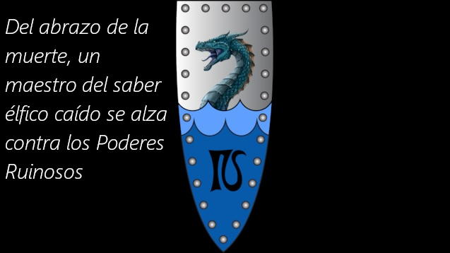
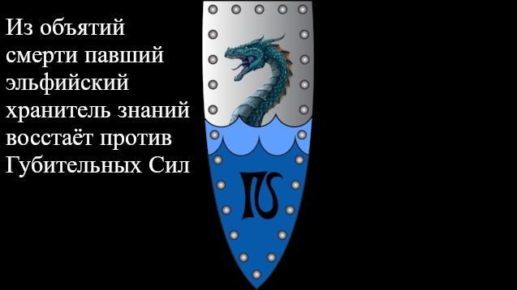
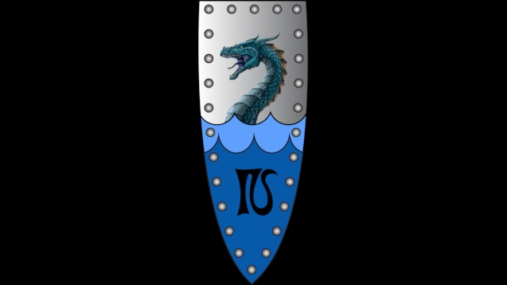
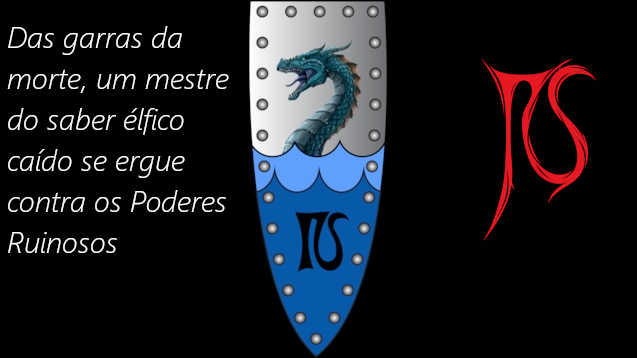
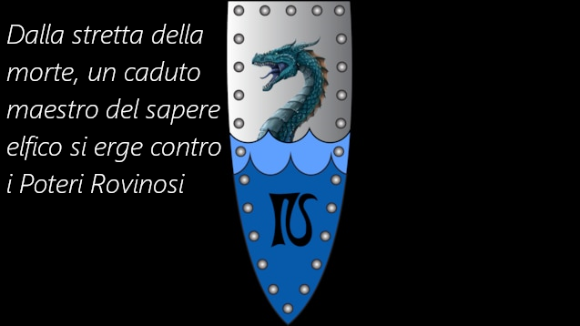
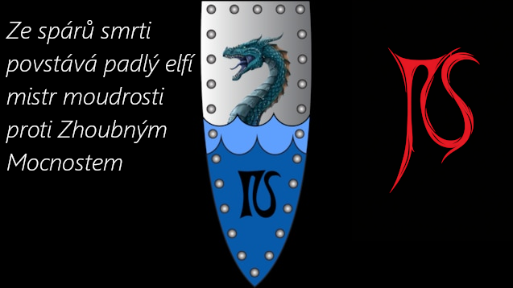
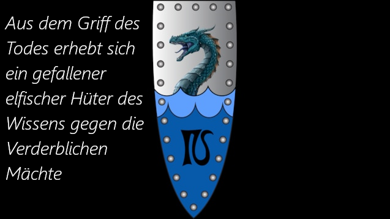
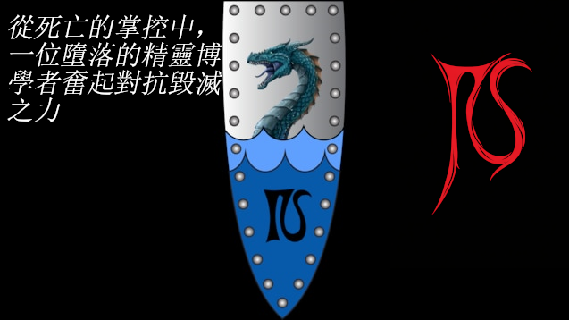

# Total War: Warhammer III : Idrinth

## Idrinth Thalui: The Knight-Scholar

### The Tale of a Fallen Loremaster

Once a respected High Elven Loremaster, Idrinth Thalui met his mortal end during the bloody Vampire Wars, only to rise again as one of the very creatures he fought against. Now this Knight-Scholar walks a precarious path between his elven heritage and vampiric curse, seeking purpose in a world torn by Chaos.

Will you guide him toward redemption or embrace the darkness within? His fate rests in your hands.

## Mods

| Mod | Logo | Description |
|-----|-----|-------------|
| [Main Mod (English)](idrinth/README.md) |  | The core Idrinth Thalui mod with all features |
| [No Upkeep Scaling](idrinth-no-upkeep/README.md) |  | Removes upkeep scaling from skill choices |

### Translations 

I fully support translations of this mod, they can be edited on [crowdin](https://crowdin.com/project/idrinth-thalui/invite?h=e154f2cc138e3ad109516051cdd96edf2662006) by anyone as well if they aren't perfect or something is missing. Currently known translations are:

| Language | Logo | Steam Workshop | GitHub |
|----------|-----|----------------|--------|
| German/Deutsch |  | [Steam](https://steamcommunity.com/sharedfiles/filedetails/?id=3626835116) | [README](idrinth-de/README.md) |
| French/Francais |  | [Steam](https://steamcommunity.com/sharedfiles/filedetails/?id=3630581892) | [README](idrinth-fr/README.md) |
| Spanish/Espanol |  | [Steam](https://steamcommunity.com/sharedfiles/filedetails/?id=3636871019) | [README](idrinth-es/README.md) |
| Russian/Russkij |  | [Steam](https://steamcommunity.com/sharedfiles/filedetails/?id=3643165732) | [README](idrinth-ru/README.md) |
| Polish/Polski |  | [Steam](https://steamcommunity.com/sharedfiles/filedetails/?id=3646225214) | [README](idrinth-pl/README.md) |
| Portuguese/Português |  | [Steam](https://steamcommunity.com/sharedfiles/filedetails/?id=3648565436) | [README](idrinth-pt/README.md) |
| Italian/Italiano |  | [Steam](https://steamcommunity.com/sharedfiles/filedetails/?id=3648565302) | [README](idrinth-it/README.md) |
| Czech/Čeština |  | [Steam](https://steamcommunity.com/sharedfiles/filedetails/?id=3649208503) | [README](idrinth-cs/README.md) |
| Turkish/Türkçe |  | [Steam](https://steamcommunity.com/sharedfiles/filedetails/?id=3649209623) | [README](idrinth-tr/README.md) |
| Korean/한국어 |  | [Steam](https://steamcommunity.com/sharedfiles/filedetails/?id=3652335450) | [README](idrinth-ko/README.md) |
| Simplified Chinese/简体中文 |  | [Steam](https://steamcommunity.com/sharedfiles/filedetails/?id=3652335354) | [README](idrinth-cn/README.md) |
| Traditional Chinese/繁體中文 |  | [Steam](https://steamcommunity.com/sharedfiles/filedetails/?id=3652336330) | [README](idrinth-zh/README.md) |

## ALPHA VERSION NOTICE

This mod is in **EARLY ALPHA** development. You may encounter:

- Some UI-Changes take a second to apply
- Balance adjustments ongoing
- Prayer system temporarily replaced by random triggering godly interventions

Your feedback is essential for improvement! Please report any issues you encounter.

## Compatibility Note:

The custom faction of Nagash is theoretically supported. The support needs play-testing though, if you find bugs report them here and don't bother the other mod!

## AI in this mod

There are currently some AI-generated images in the mod. They are being replaced by proper art over time once the unit identity and looks are final.

## Socials

If you want to discuss the mod or need support, feel free to drop by on [Discord](https://discord.gg/idrinth)!
